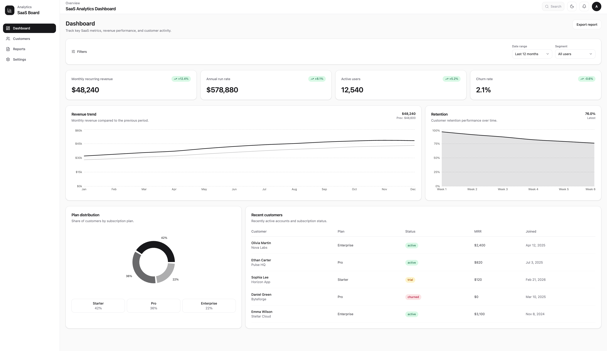
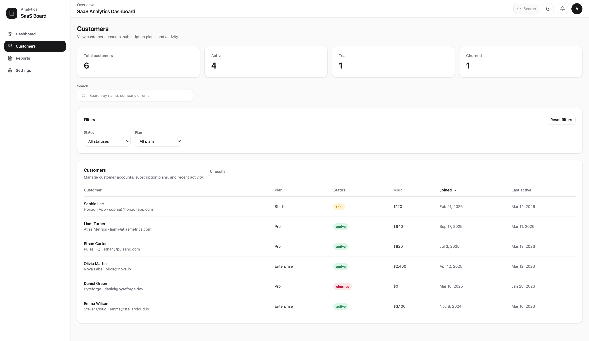

# SaaS Analytics Dashboard


[](LICENSE)

A modern analytics dashboard built with **React + TypeScript** that simulates a real SaaS admin panel.

The project demonstrates a production-style frontend architecture with reusable UI components, feature-based structure, state management, data fetching, and interactive charts.

---

# Live Demo

https://saas-analytics-dashboard-psi.vercel.app

---

# Screenshots

## Dashboard



## Customers



---

# Features

### Dashboard

- SaaS KPI overview
- Revenue trend chart
- Customer retention chart
- Subscription plan distribution
- Recent customers table

### Customers

- Customer list
- Search by name, company or email
- Filters by status and subscription plan
- Sortable columns
- Sticky table header
- Summary metrics
- Loading / empty / error states

### UI / UX

- Dark / light theme
- Responsive layout
- Sticky sidebar navigation
- Reusable UI components

---

# Tech Stack

### Core

- React
- TypeScript
- Vite

### State & Data

- Zustand
- TanStack Query

### UI

- Tailwind CSS
- Lucide Icons
- Reusable UI component system

### Charts

- Recharts

---

# Architecture

The project follows a **feature-oriented architecture** inspired by modern frontend practices.

```text
src/
├── app/        # application setup
├── entities/   # business entities (customer, analytics)
├── features/   # user interactions (filters, sorting)
├── widgets/    # composed UI blocks
└── shared/     # reusable UI components and utilities
```

This structure helps keep the codebase scalable and maintainable.

---

# Getting Started

### Install dependencies

```bash
npm install
```

### Start development server

```bash
npm run dev
```
